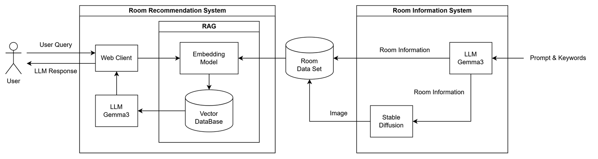
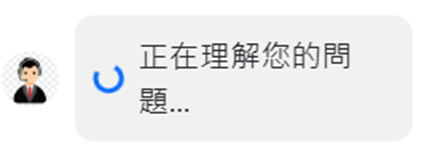
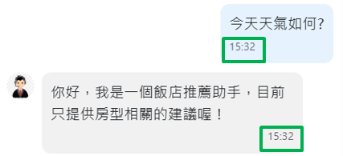
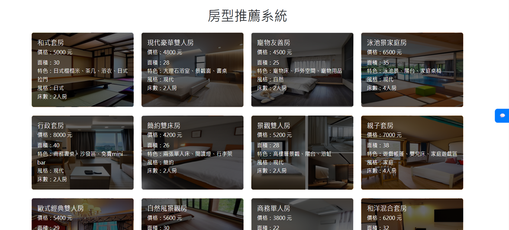
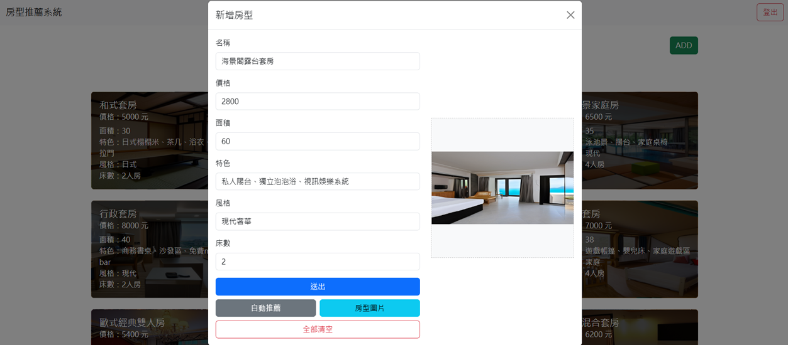
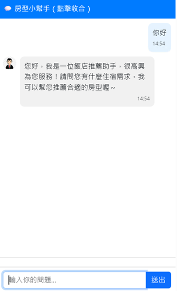
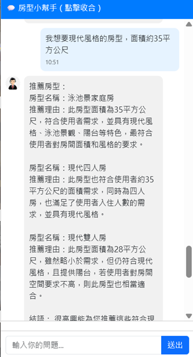
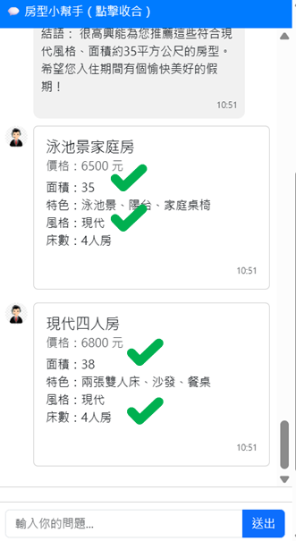
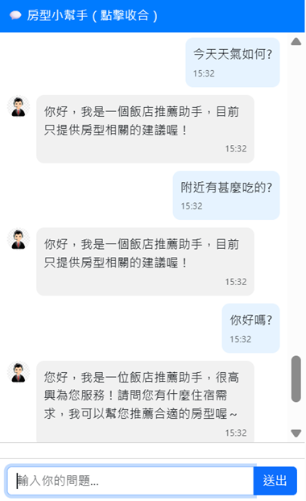

# Room-Type-Recommendation-System

## Overview
- Frond-End : HTML + JavaScript
- Back-End : Python + Flask + RAG + Stable Diffusion (text-to-image)
- Tool : LangChain + Ollama + gemma3

## Features
- 每個房型資訊包含「房型名稱」、「價格」、「面積」、「特色」、「床數」
- 前端畫面每個房型資訊使用 Card 呈現
- 點擊 Card 可預覽房型圖片
- 顧客可透過智慧聊天機器人(Chatbot)找出符合條件的房型
- 管理者(admin)可使用自動推薦產生房型相關資訊 & 房型圖片

## Structure Diagram

## Other Features
<ul style="list-style: disc; padding-left: 20px; line-height: 1.6;">
  <li>
    新增等待回應之 Pending 圖示 
    
  </li>
  <li>
    新增時間戳 
    
  </li>
  <li>聊天室窗中，按下 <kbd>Enter</kbd> 鍵即可送出訊息</li>
  <li>展開房型圖片後，按下 <kbd>ESC</kbd> 即可回復原狀</li>
</ul>

## Website

## Auto Recommendation

## Chatbot
### Case1 : 打招呼

### Case2 : 查詢房型

    
    

### Case3 : 與房型資訊無關之問題

